> 📌 **Note**  
> This repository contains a **fully working Flutter assessment task for Aqore Software Pvt. Ltd.**  
> The project implements the complete **Inventory & Order Management Application** as described in the task requirements, including full CRUD operations, offline-first database storage, and receipt generation logic.

# Aqore Mobile App Documentation

## Overview

Aqore is a Flutter-based mobile application designed for small businesses to efficiently manage suppliers, inventory items, purchase orders, and receipts with an offline-first approach using local database storage.

**[⠛ View Architecture Diagrams →](https://drive.google.com/file/d/1bNE2ymfaIycsCecWD_jO11Eg8pkMXzca/view?usp=sharing)**

---

> Below are real screenshots from the running application demonstrating all major modules and workflows.
## Application Screenshots (Module-wise)

| Setup Business | Business Info |
|---------------|-----------------|
|  |  |

---

### Supplier Management
| Supplier Initial | Suppleir List | Add Supplier | Edit Supplier |
|--------------|--------------|---------------|---------------|
| 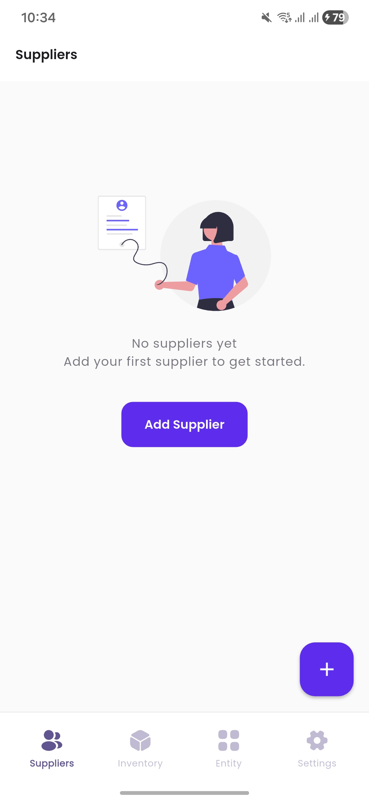 | 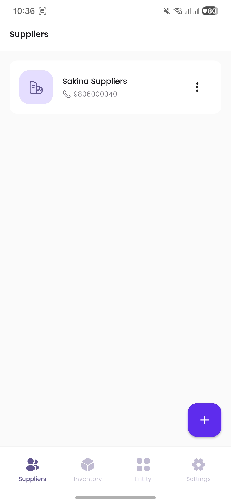 | 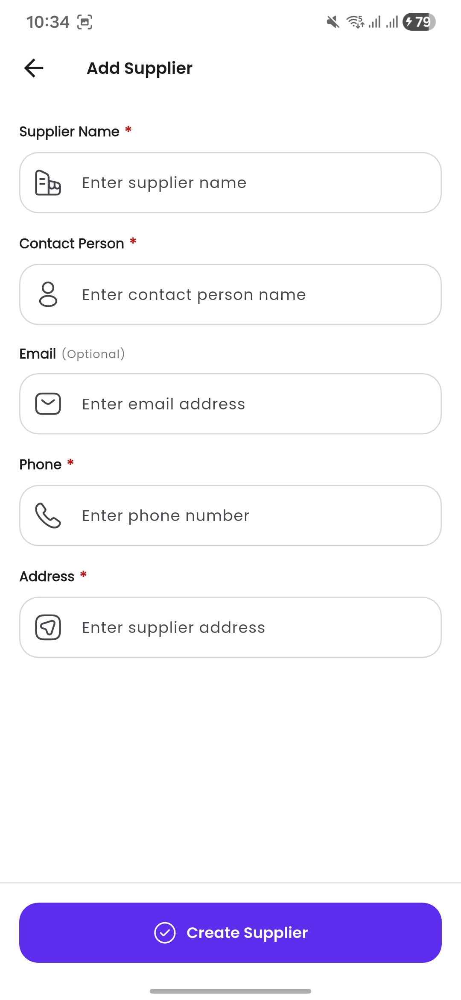 | 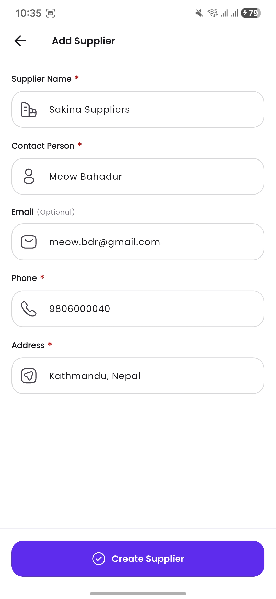 |

| Supplier Details | Additional Suppliers | Delete Supplier |
|-----------------|----------------|----------------|
| 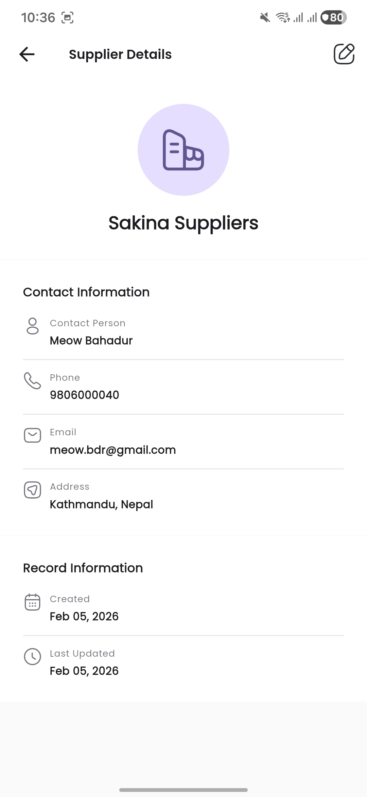 | 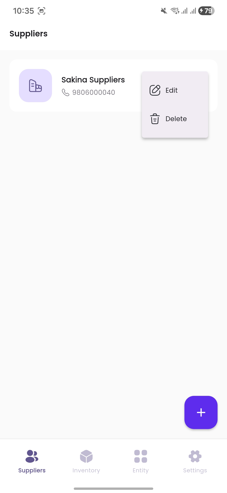 | 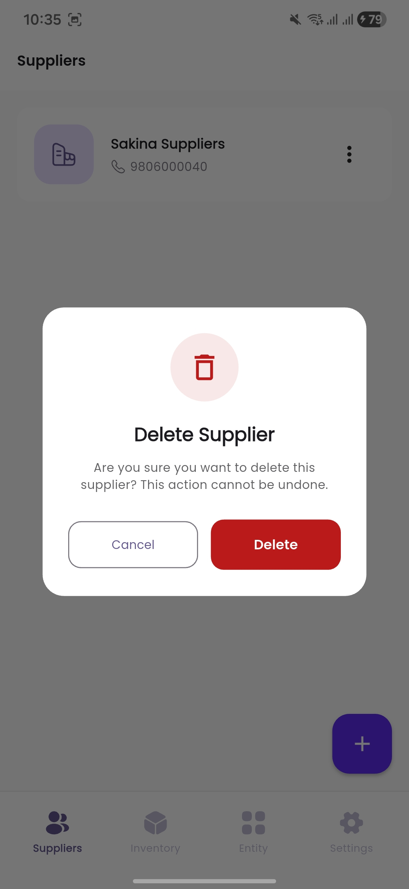 |

---

### Inventory / Item Management
| Item Initial | Add Item | Item List | Item Details |
|----------|----------|--------------|--------------|
| 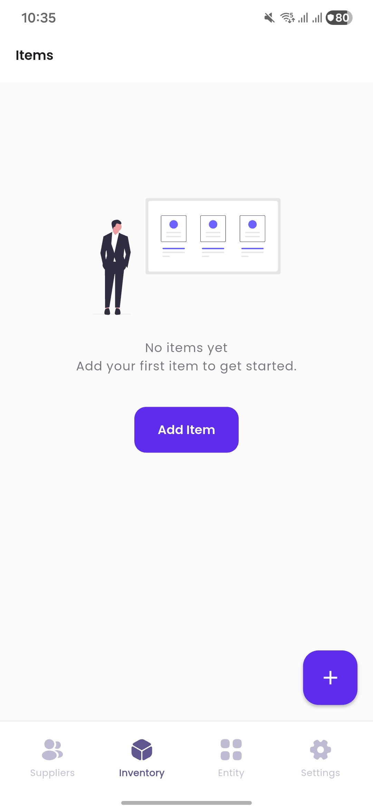 |  | 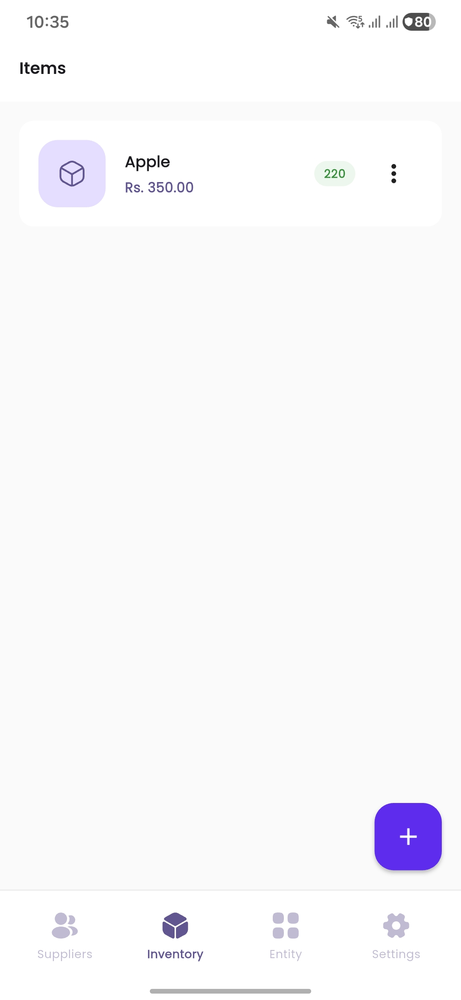| 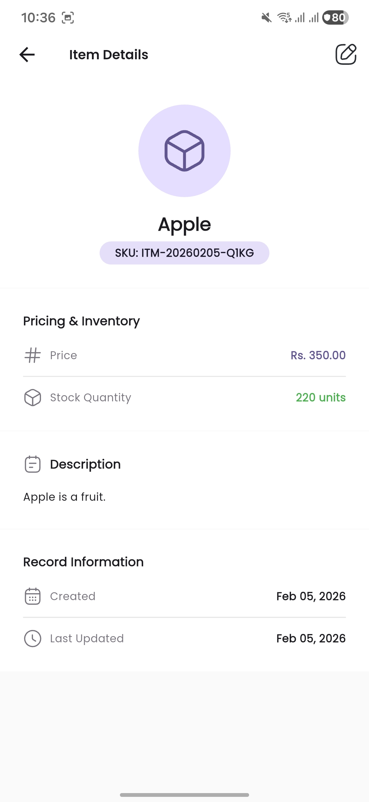 |

| Item Delete | 
|-------------|
| 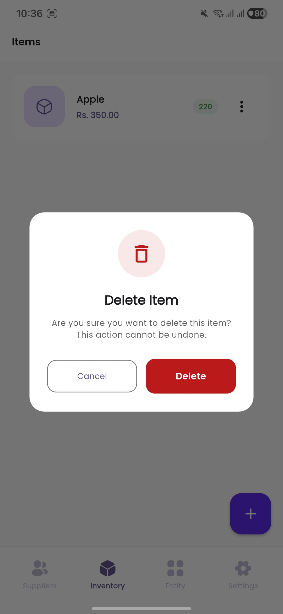 |

---

### Purchase Order Management
| Order List | Create Order | Order Items |
|-----------|--------------|-------------|
| 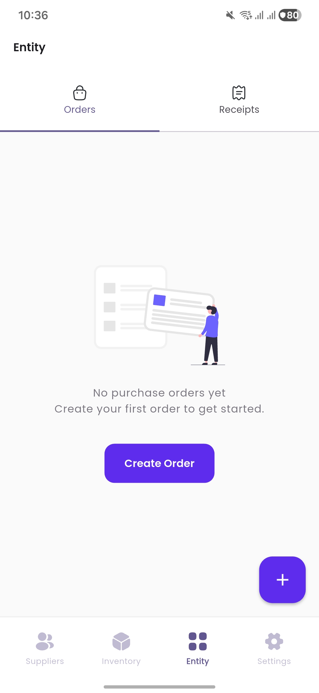 | 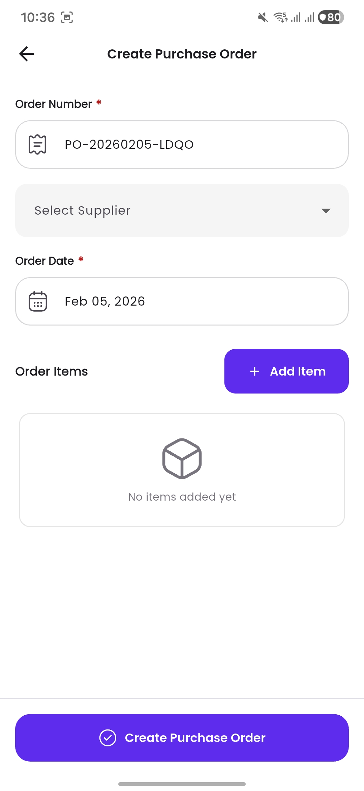 | 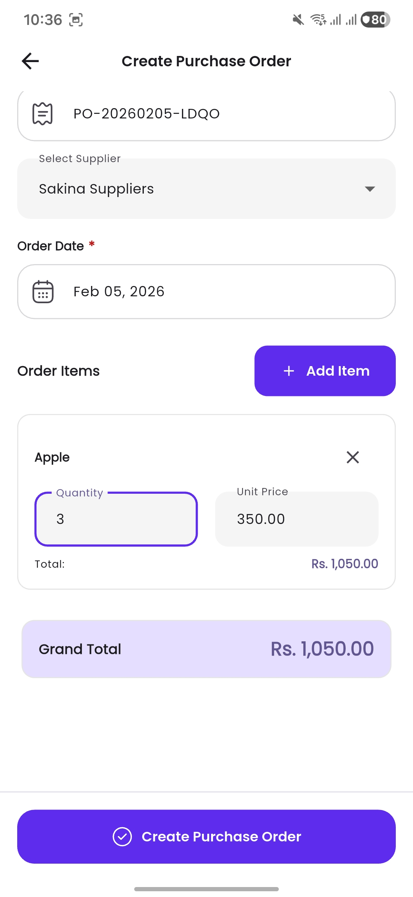 |

| Order List | Order Detail |
|--------------|--------------|
| 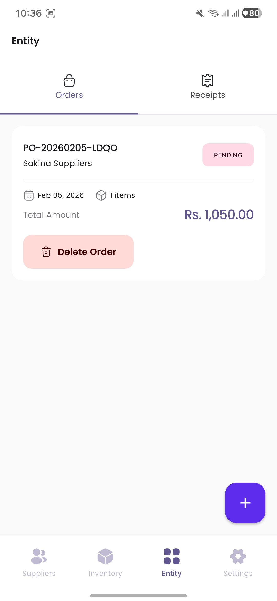 |  |

---

### Receipt Generation
| Receipt Initial | Generate Receipt | Receipt List | Receipt Detail |
|-------------|------------------|----------------|----------------|
| 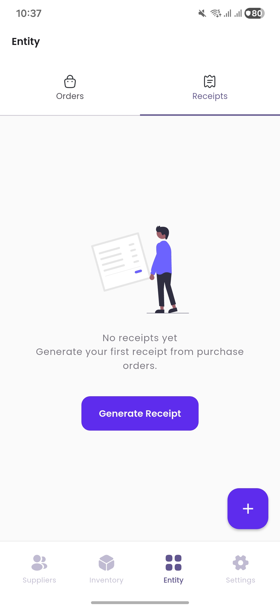 | 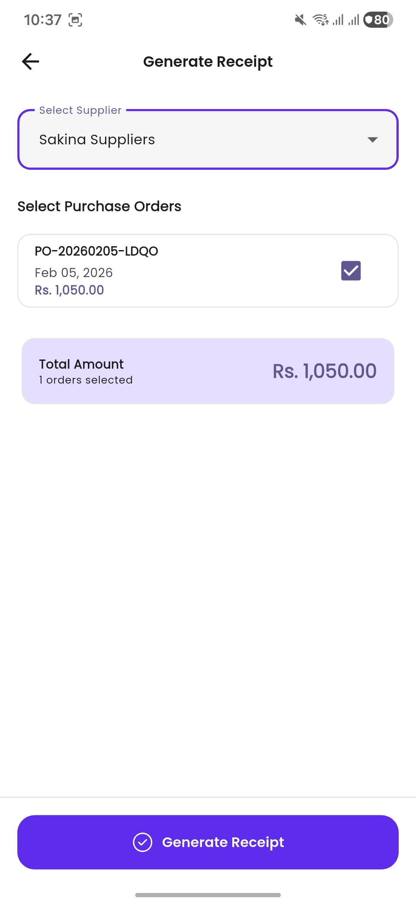 | 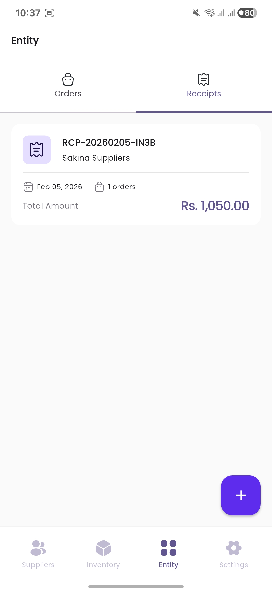 | 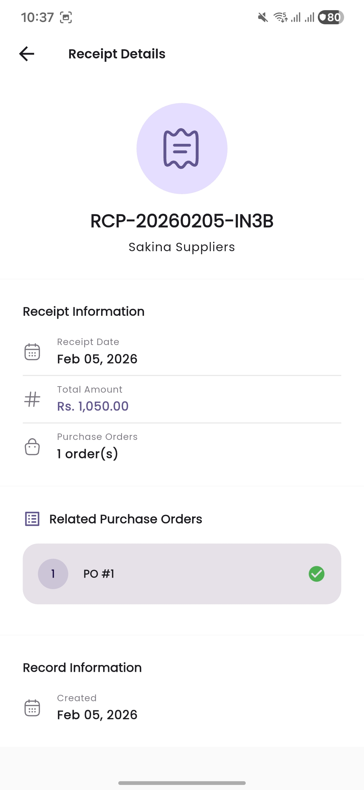 |

---

### Settings
| Settings | Preferences |
|---------|-------------|
| 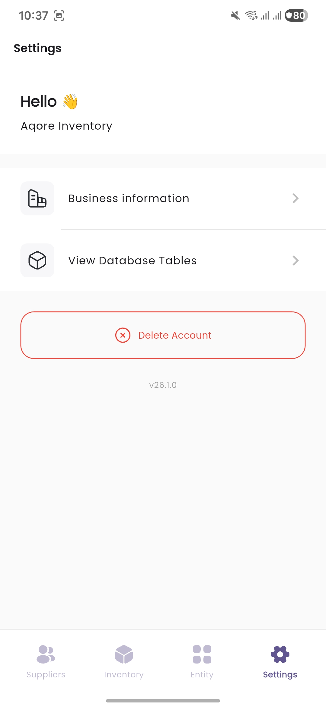 | 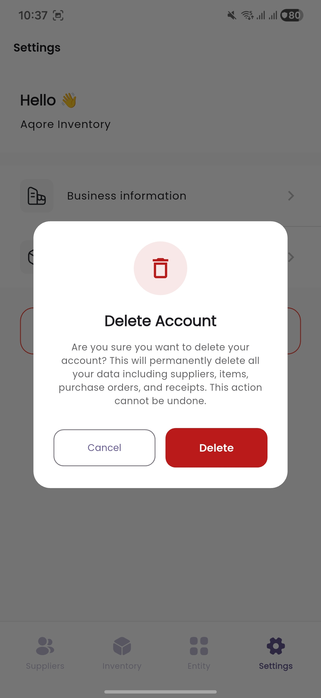 |

---

## Hardware Requirements

### Minimum Requirements

- **Processor**: Intel Core i3 (8th Gen) or AMD Ryzen 3
- **RAM**: 8GB
- **Storage**: 40GB available space
- **OS**: Windows 10 (64-bit) / macOS Monterey / Linux (Ubuntu 20.04+)
- **GPU**: Integrated Graphics
- **Display**: 1280x800 resolution

### Recommended Requirements

- **Processor**: Intel Core i5/i7 (10th Gen) or AMD Ryzen 5/7
- **RAM**: 16GB or more
- **Storage**: SSD with at least 40-70GB free space
- **OS**: Windows 11 / macOS Ventura / Latest Linux (Ubuntu 22.04+)
- **GPU**: Dedicated GPU for better rendering performance
- **Display**: 1920x1080 resolution

---

## Software Requirements

- **Flutter SDK**: 3.9.2 or higher ([Download Here](https://flutter.dev/docs/get-started/install))
- **Dart SDK**: 3.10.0 or higher (comes with Flutter)
- **IDE**: Android Studio / Visual Studio Code / IntelliJ IDEA
- **Android SDK**: API Level 21 (Android 5.0) or higher
- **Xcode**: 14.0+ (required for iOS development, Mac only)
- **Git**: Version control system
- **Java JDK**: 11 or higher (for Android builds)
- **CocoaPods**: 1.11.0+ (for iOS development, Mac only)

---

## Installation Process

### 1. Clone the Repository

```bash
git clone https://github.com/itsmelaxman/aqore-task.git
cd aqore_app
```

### 2. Verify Flutter Installation

```bash
flutter doctor
```

### 3. Install Flutter Dependencies

```bash
flutter pub get
```

### 4. Generate Database Code

```bash
dart run build_runner build --delete-conflicting-outputs
```

### 5. Run the Project

```bash
flutter run
```

### 6. Build for Production

```bash
flutter build apk --release   # For Android
flutter build ios --release   # For iOS (Mac required)
```

---

## Project Structure

```
aqore_app/
├── android/                     # Native Android platform code
├── ios/                         # Native iOS platform code
├── linux/                       # Linux platform support
├── macos/                       # macOS platform support
├── web/                         # Web platform support
├── windows/                     # Windows platform support
├── assets/                      # Static assets
│   ├── images/                  # Image files
│   └── svg/                     # SVG icons and graphics
│       └── icons/               # Icon assets
├── guide/                       # Documentation and architecture diagrams
│   ├── flow.md                  # Architecture flow guide
│   └── *.svg                    # Visual diagrams
├── lib/                         # Main application source code
│   ├── app/                     # Application layer
│   │   ├── bindings/            # Dependency injection
│   │   ├── data/                # Data layer
│   │   │   ├── local/           # Drift database & tables
│   │   │   └── services/        # Business services
│   │   ├── modules/             # Feature modules
│   │   │   ├── supplier/        # Supplier management
│   │   │   ├── item/            # Inventory management
│   │   │   ├── purchase_order/  # Purchase orders
│   │   │   ├── receipt/         # Receipt generation
│   │   │   ├── home/            # Dashboard
│   │   │   └── settings/        # App settings
│   │   ├── routes/              # Navigation & routing
│   │   └── theme/               # App theming
│   ├── core/                    # Core shared resources
│   │   ├── constants/           # App constants
│   │   ├── utils/               # Utilities
│   │   └── widgets/             # Reusable widgets
│   └── main.dart                # Application entry point
├── test/                        # Unit and widget tests
├── pubspec.yaml                 # Project dependencies
├── analysis_options.yaml        # Dart analysis configuration
└── README.md                    # Project documentation
```

---

## Technology Stack

| Technology            | Version    | Purpose                       |
| --------------------- | ---------- | ----------------------------- |
| **Flutter**           | SDK 3.9.2+ | Cross-platform UI framework   |
| **Dart**              | SDK 3.10.4 | Programming language          |
| **GetX**              | 4.6.6      | State management, DI, routing |
| **Drift**             | 2.20.0     | Type-safe SQLite database     |
| **SQLite**            | -          | Local database storage        |
| **Google Fonts**      | 6.2.1      | Typography                    |
| **Flutter SVG**       | 2.2.3      | Vector graphics support       |
| **SharedPreferences** | 2.3.4      | Key-value storage             |
| **Path Provider**     | 2.1.4      | File system paths             |
| **Intl**              | 0.19.0     | Internationalization          |

---

## Running Tests

```bash
# Run all tests
flutter test

# Run tests with coverage
flutter test --coverage
```

---

## Building for Production

### Android APK

**Standard APK**

```bash
flutter build apk --release
```

Output: `build/app/outputs/flutter-apk/app-release.apk`

**Split APKs (smaller size)**

```bash
flutter build apk --split-per-abi --release
```

**App Bundle (Google Play)**

```bash
flutter build appbundle --release
```

### iOS Build (macOS only)

```bash
flutter build ios --release
```
